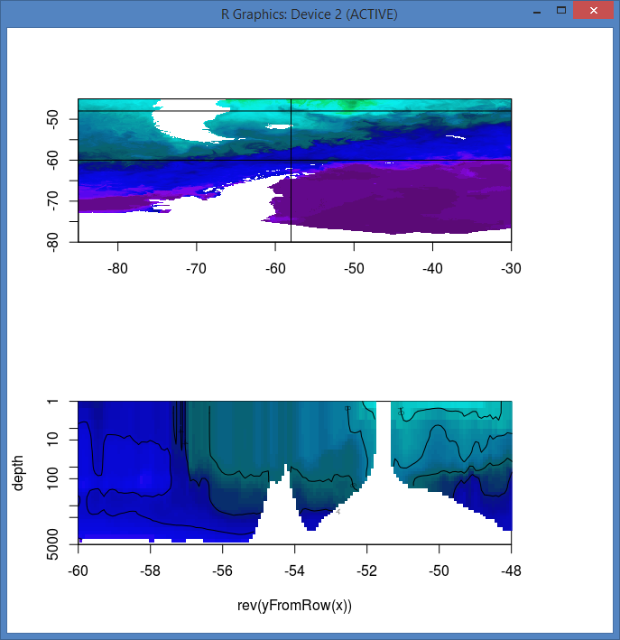
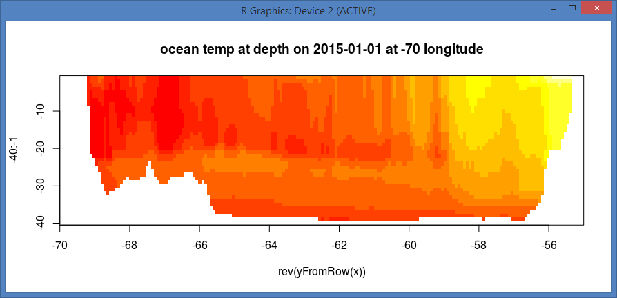

```R
library(ncdf4)
nc <- nc_open("http://tds.hycom.org/thredds/dodsC/GLBu0.08/expt_91.1/ts3z")

lon <- ncvar_get(nc, "lon")
lat <- ncvar_get(nc, "lat")
depth <- ncvar_get(nc, "depth")

#units: hours since 2000-01-01 00:00:00
time <- (ncvar_get(nc, "time") * 3600) + as.POSIXct("2000-01-01 00:00:00", tz = "UTC")
range(time)
#[1] "2014-04-07 UTC" "2015-09-07 UTC"

source("R/hycom.R") 
transect <- -58
x <-  readhycom("2015-01-01", xlim = c(-85, -30), ylim = c(-80, -45), zlim = c(0, 4))
xx <- extract(x, cbind(transect, yFromRow(x)))
pal <- palr::sstPal(palette = TRUE)
depth[1] <- 1
par(mfrow = c(2, 1))
plot(x[[1]], asp = NA, col = pal$cols, breaks = pal$breaks, legend = FALSE)
latlim <- c(-60, -48)
abline(h = latlim)
lines(cbind(transect, yFromRow(x)))
image(rev(yFromRow(x)), depth, xx[nrow(xx):1,], xlim = latlim, col = pal$cols[-1],  breaks = pal$breaks, log = "y", ylim = rev(range(depth)))

contour(rev(yFromRow(x)), depth, xx[nrow(xx):1, ], add = TRUE)    
```






